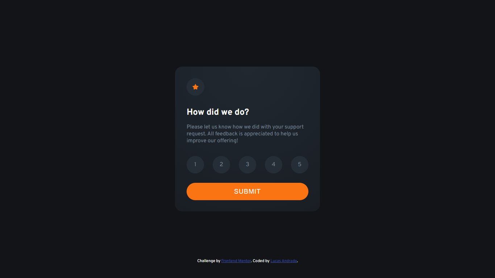

# Frontend Mentor - Interactive rating component solution

This is a solution to the [Interactive rating component challenge on Frontend Mentor](https://www.frontendmentor.io/challenges/interactive-rating-component-koxpeBUmI). Frontend Mentor challenges help you improve your coding skills by building realistic projects. 

## Table of contents

- [Overview](#overview)
  - [The challenge](#the-challenge)
  - [Screenshot](#screenshot)
  - [Links](#links)
- [My process](#my-process)
  - [Built with](#built-with)
  - [What I learned](#what-i-learned)
- [Author](#author)

## Overview

The challenge requires a basic understanding of HTML, CSS, and JavaScript, and it involves building an interactive rating component that closely resembles the design provided. The project requires building an interactive component that allows users to select and submit a number rating, see the "Thank you" card state after submitting a rating, and see hover and focus states for all interactive elements on the page. The project also provides a README.md file to help you get started. You can use any tools you like to help you complete the challenge.

### The challenge

Users should be able to:

- View the optimal layout for the app depending on their device's screen size
- See hover states for all interactive elements on the page
- Select and submit a number rating
- See the "Thank you" card state after submitting a rating

### Screenshot



### Links

- Solution URL: [Add solution URL here](https://your-solution-url.com)
- Live Site URL: [Add live site URL here](https://your-live-site-url.com)

## My process

I started my project by structuring the HTML. So I created a file to write my CSS and then I added the font I would use and saved the project’s color palette in variables. Finally, I created my JS file and implemented a function that simulates a fake request, displaying the thank you message and the rating the user gave.

### Built with

- CSS custom properties
- Flexbox
- JS

### What I learned

- link CSS and JS files with link and script tags

```html
  <link />
  <script></script>
```

- DOM manipulation with JS
- Submit Event Listesner
- A little bit about Form manipulation with JS

```js
const myDocumentElement = document.querySelector('.my-element')
console.log(myDocument)
```

## Author

- Frontend Mentor - [@yourusername](https://www.frontendmentor.io/profile/yourusername)
